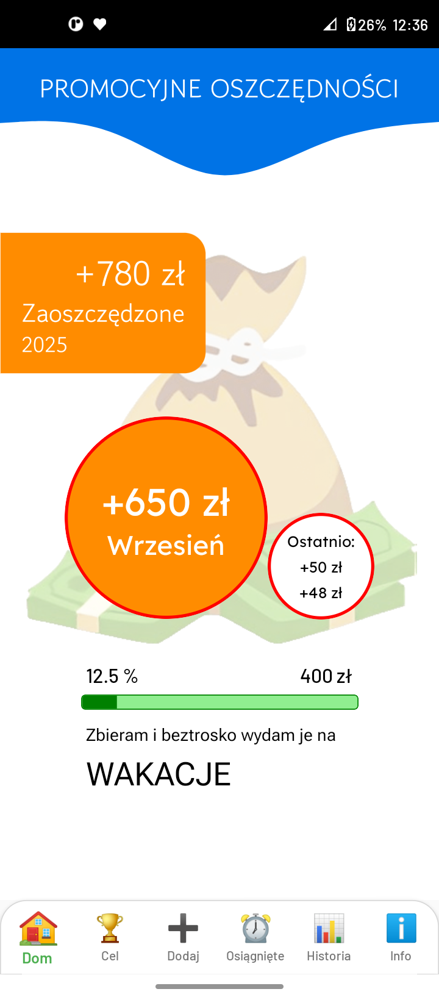
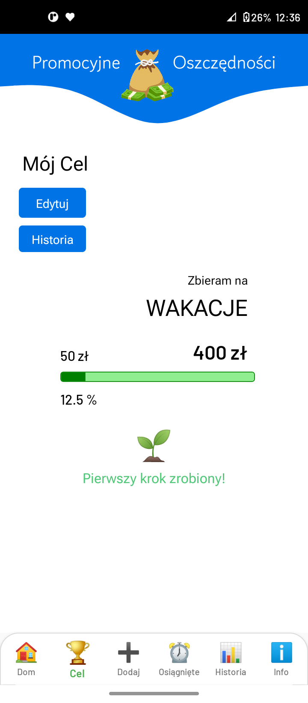
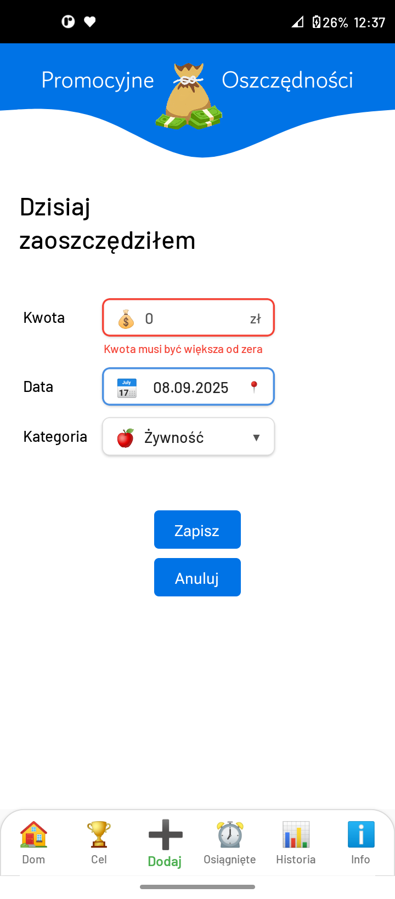
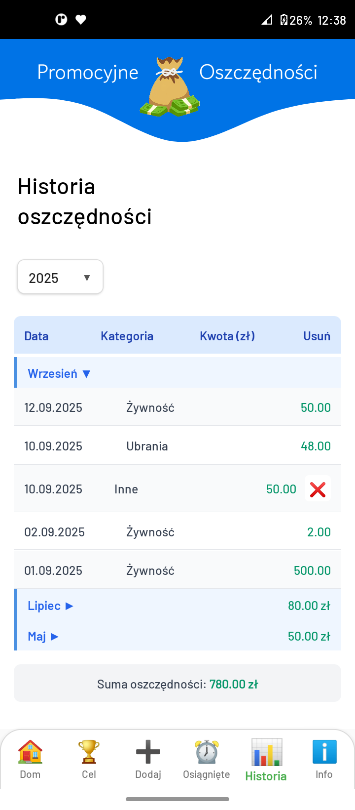
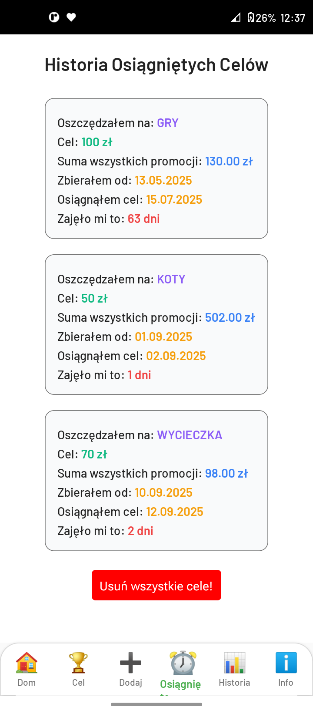
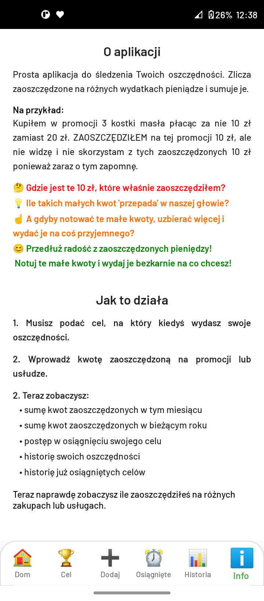

  
  
  
  
  
  

# 💰 Promotional Savings [PL App]

A free mobile application for Android phones that helps users track money saved through promotions and deals. The app allows setting financial goals and monitoring progress in achieving them.

Works offline!

### ✨ Main Features

- **📊 Savings tracking** - Adding and categorizing saved amounts
- **🎯 Goal management** - Setting and monitoring financial goals
- **📅 History** - Monthly and yearly savings history
- **🏆 Goal history** - Overview of all achieved goals
- **💾 Local storage** - Data stored locally on the device

### 🔄️ User Data Flow

(it's svg - open in new window to full size for better readibilty)

  

### 🏗️ Application Architecture

#### Screens

- **Home** - Main screen with summary and navigation
- **AddSaving** - Adding new savings
- **Goal** - Managing financial goals
- **HistorySavings** - History of all savings
- **HistoryGoals** - History of achieved financial goals

#### State Management

- **Zustand** - Main store for savings
- **ASync Storage** - Fast, local data storage

#### Components

- **UI Components** - Buttons, forms, progress bars
- **Business Components** - Logic related to savings and goals

## 🛠️ Technologies

- **React Native 0.81.4** - Mobile framework
- **TypeScript 5.9.2** - Static typing
- **React 19.1.0** - UI library
- **React Navigation 7.x** - Screen navigation
- **Zustand 5.0.6** - Application state management
- **ASync Storage 2.2.0** - Fast data storage
- **React Native Calendars 1.1313.0** - Calendar components
- **React Native Progress 5.0.1** - Progress bars
- **Date-fns 4.1.0** - Date manipulation
- **ESLint 8.57.1** - Code linting

## 🚀 Installation and Setup

### Installation

1. **Clone the repository**

`git clone https://github.com/artur-IT/Promotional-savings.git`

`cd Promotional-savings`

2. **Install dependencies** - `npm install`
3. **Run Metro bundler** - `npx react-native run-android` (Automatically starts Metro)
4. **compile to .aab** - `./gradlew bundleRelease` (for Google Play Store)
5. **Compile to APK file** - in the android folder run

`.\gradlew assembleRelease -PreactNativeArchitectures=arm64-v8a`

After the build completes, the APK file will be at:
`android/app/build/outputs/apk/release/app-release.apk`

### 📱 Running on Device

- **Android**: Connect device via USB with developer mode enabled and use Android Studio emulator or upload the APK file and install the app.

## 🎨 Detailed Features

### Adding Savings

- Enter saved amount
- Choose savings category
- Select savings date

### Financial Goals

- Financial goal name
- Setting target amount
- Real-time progress tracking
- Progress bar visualization
- History of completed goals
- Savings history

### Statistics

- Monthly and yearly summaries
- Recently added savings

## 🔧 Troubleshooting

### Common Issues

1. **Metro bundler won't start** - ` npx react-native start --reset-cache`

2. **Dependency issues** - `rm -rf node_modules
npm install`

3. **Android issues**

   cd android
   `./gradlew clean`
   cd ..
   ` npm run android`

More information in the [official troubleshooting documentation](https://reactnative.dev/docs/troubleshooting).

 

## 🙂Do you like it?

You can buy for us 💑 coffee <a href="https://buycoffee.to/artur-dev" target="_blank" rel="noopener noreferrer">☕</a>
